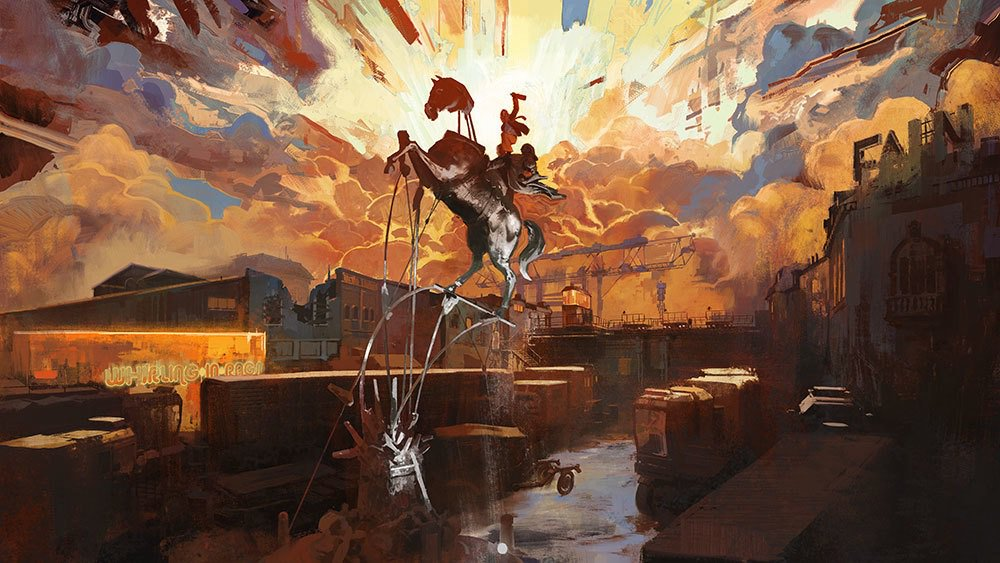
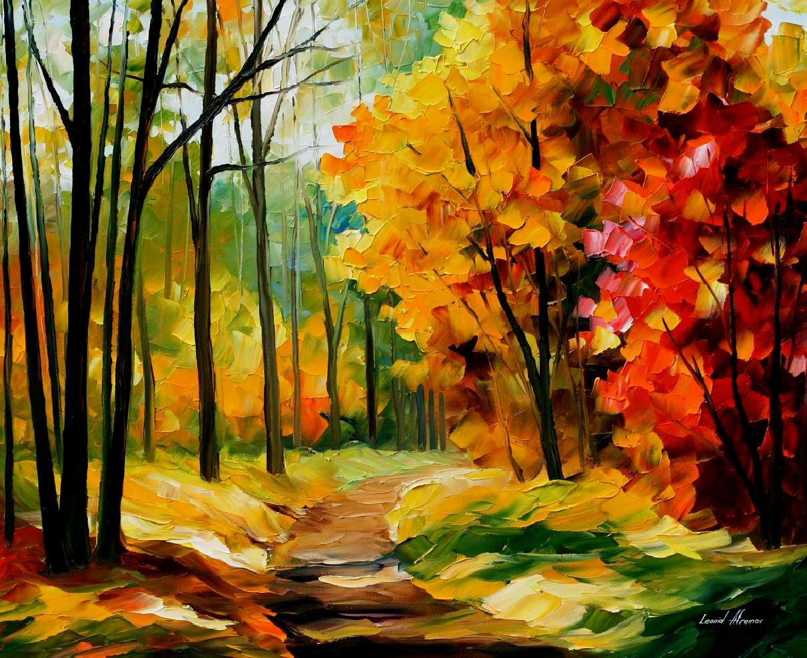

# Style-Texture

This is an implementation that is based on the Neural Style Transfer paper (Gatys et.al. ). It takes a source image, from which the reference style needs to be derived and generates a series of 'style' images that are obtained by running the model over multiple epochs.

**Goal** : The main idea was initially to use the style as a form of texture synthesis rather than a one-to-one image transfer as depicted in the original paper. The image that is obtained can be used further on in a rendering context.

**Notes** : 
* The model heavily depends on the hyperparameters and the layers selected (in this case, the activation layers selected are : “block1_conv1”, “block2_conv1”, “block3_conv1”, “block4_conv1”, “block5_conv1” ).
* Detection of certain low-level textural elements such as lines and contours are affected by the change in Hue and Intensity over the image.
* Results obtained are generally a hit-or-miss depending on the initial style image taken. Moreover, the optimizer chosen (Adam), layers selected, and loss (Gram matrix) need to be tuned per image. In some cases, the intermediate results obtained offer a far better texture than the minimized result. (This again depends on the end usecase).
* Result hue/texture deviates towards dominant hue/texture present in the image. (as seen in the example gifs below)
* Isolating/ Segmenting certain sections of the image to extract textural/ lighting/ material information is the next step planned. (Work in Progress)

**Results** :
    
  
    
    Source image : Disco Elysium artwork (left)] (style_disco_elysium.jpg)
    Result (right) [parameters : 10000 iterations, style loss = 10e6, variation loss = 10e3
 
  
    
    Source image : The path to the heart by Leonid Afremov (left)
    Result (right) [parameters : 10000 iterations, style loss = 10e6, variation loss = 10e3

Train the model by running:
  
    python nst.py --style_img [style_img path] --img_dim_h [Result Height] --img_dim_w [Result Width] --num_iter [Iterations] --style_loss_weight [default: 10e6] --variation_loss_weight [default: 10e3] --print_every [default: 1000] --save_every [default: 100] by setting the flags.
